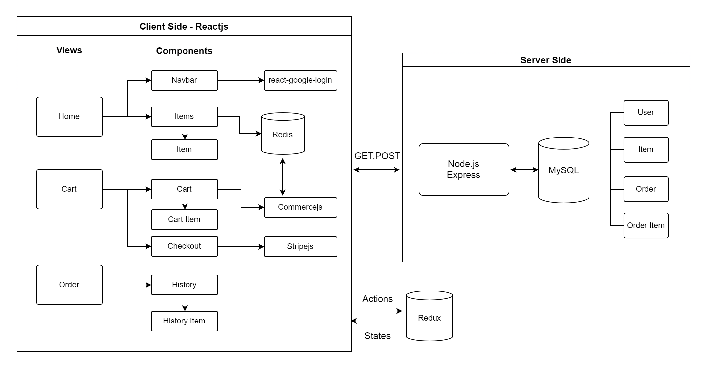
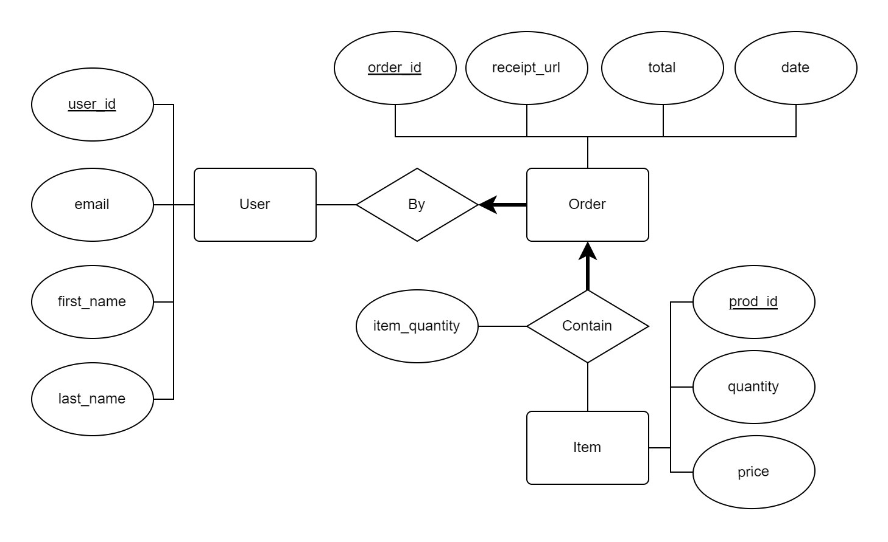

# E-Commerce Shop

E-Commerce Shop provides a shop interface that allows user to purchase listed items online.
User can add selected products into a cart and pay using card. On successful payment user will receive a receipt and purchase history will be saved.

Visit the deployed site [here](https://mhcheng-shop.netlify.app/)

## Demo

## Technical Architecture 

Frontend: 
 - Reactjs
 - Hosted on Netlify

Backend:
 - Node.js using Express
 - Hosted on Heroku
 - Unit testing with Jest

Database:
 - MySQL

Diagram:

User's Flow
- User accesses the web app in browser.
- Browser pulls static resources from Commercejs.
- Web site update product catalog to database.
- User login with Google Auth and register user to database, update states in Redux.
- User add items to cart and checkout.
- Web site posts order detail on success to database.
- User view completed order and queries database.

Third Party Integrations:
- [Stripejs](https://stripe.com/) integrated in checkout component to verify payment
- [Commercejs](https://commercejs.com/) is used for storing/retrieving item information such as item name, price, and image and maintaining the cart
- `react-google-login` package allows for Google auth

## Relational Database
The database is hosted using ClearDB MySQL add-ons on Heroku.

Diagram:

### Run the App Locally

Enter frontend directory from root directory

`cd front-end`

Download requirements

`npm install`

Run

`npm start`

Enter server directory from root directory

`cd server`

Download requirements

`npm install`

Run

`node server.js`

For the env variables to work create dotenv files in both front-end and server directory.
Update the keys
- REACT_APP_STRIPE_KEY= Register your Stripe account [here](https://stripe.com/) 
- REACT_APP_STRIPE_SECRET= Register your Stripe account [here](https://stripe.com/)
- REACT_APP_GOOGLE_CLIENT_ID= Your Google Client ID
- REACT_APP_COMMERCEJS_KEY= Register your Commercejs account [here](https://commercejs.com/)
- REACT_APP_FRONTEND_URL= Your prefered local frontend URL (Default http://localhost:3000)
- REACT_APP_SERVER_URL=Your prefered local server URL (Default http://localhost:8080)
- MySQL Database information

Jest Testing
`npx jest`

## Future Implementations

Register User
- Right now the user is required to login in with Google Auth
- Allow user to register using email and password for this site
- Need to increase security ex. preventing injections
